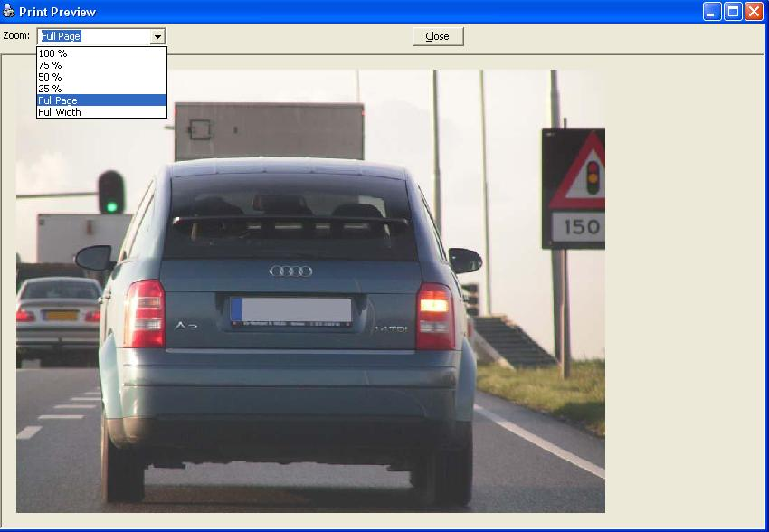



## A 1 Zoom, Scrollable PictureBox English

### Description

With this code you can Zoom in/out a PictureBox.

Also availble are scrollbars.

Zoom: 100%, 75%, 50%, 25%, FullPage and PageWidth.
 
### More Info
 

             |
---                |---
**Submitted On**   |2004-10-16 13:22:38
**By**             |[The Dutch Man](https://github.com/Planet-Source-Code/PSCIndex/blob/master/ByAuthor/the-dutch-man.md)
**Level**          |Intermediate
**User Rating**    |5.0 (30 globes from 6 users)
**Compatibility**  |VB 6\.0
**Category**       |[Graphics](https://github.com/Planet-Source-Code/PSCIndex/blob/master/ByCategory/graphics__1-46.md)
**World**          |[Visual Basic](https://github.com/Planet-Source-Code/PSCIndex/blob/master/ByWorld/visual-basic.md)
**Archive File**   |[A\_Zoom\_\_Sc18062510162004\.zip](https://github.com/Planet-Source-Code/the-dutch-man-a-1-zoom-scrollable-picturebox-english__1-56722/archive/master.zip)

